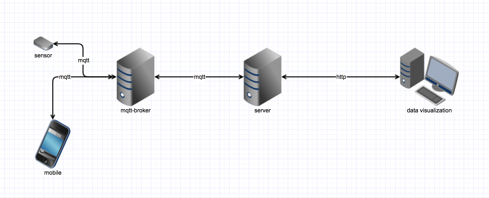

# SmartMonitor

大学毕设的修改，一个简单的物联网系统后端。

### 项目架构

基础框架|ORM|数据库|版本控制|项目构建|IDE|接口文档
-|-|-|-|-|-|-
SpringBoot|MyBatis|MySQL|Git|Maven|IntelliJ IDEA|Swagger2

### 主要功能

- 数据处理：使用MQTT协议接收并处理传感器采集到的数据
- 设备控制：使用MQTT协议转发用户发送的指令到远程设备
- 数据展示：使用ECharts实现数据可视化

